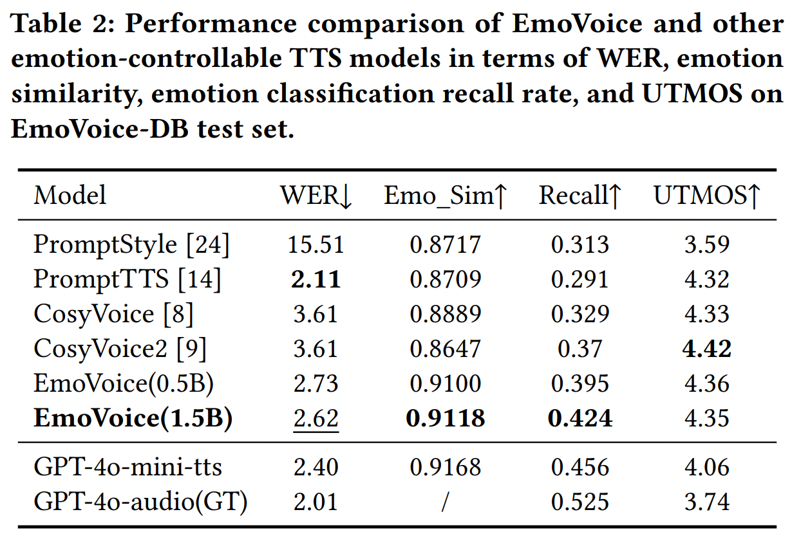
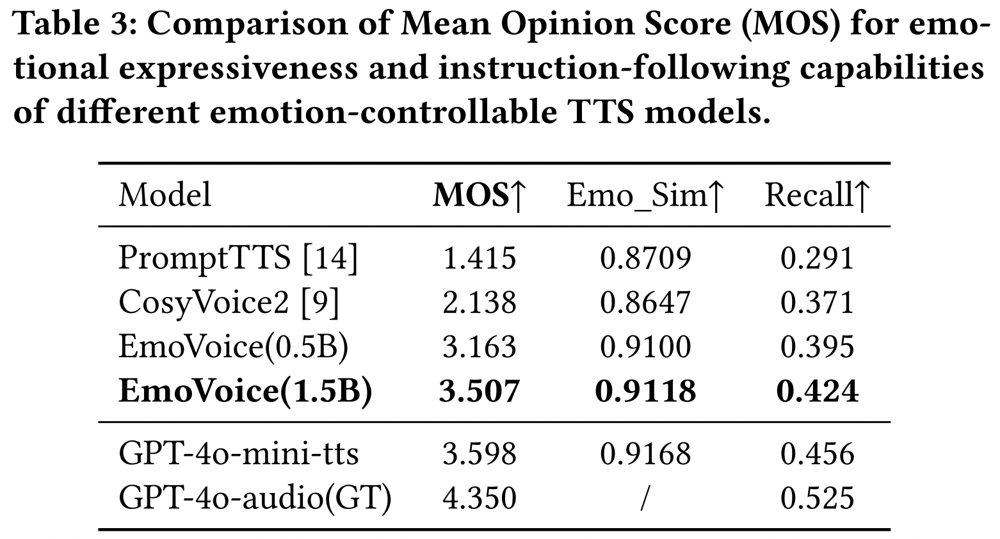
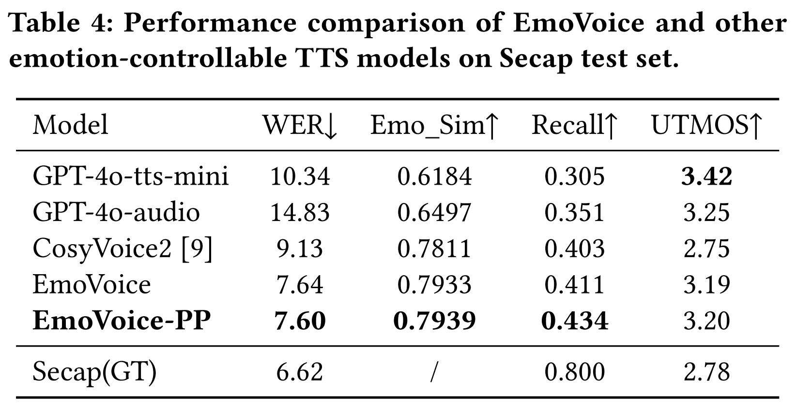

<!-- # EmoVoice: LLM-based Emotional Text-To-Speech Model with Freestyle Text Prompting -->
<div align="center">
<p align="center">
  <h1>EmoVoice: LLM-based Emotional Text-To-Speech Model with Freestyle Text Prompting</h1>
  <!-- <a href=>Paper</a> | <a href="https://meanaudio.github.io/">Webpage</a>  -->

  [](https://arxiv.org/abs/2504.12867)
  [](https://huggingface.co/yhaha/EmoVoice)
  [](https://huggingface.co/spaces/chenxie95/EmoVoice)
  [](https://huggingface.co/datasets/yhaha/EmoVoice-DB)
  [](https://yanghaha0908.github.io/EmoVoice/)


</p>
</div>


## Overview

EmoVoice is a emotion-controllable TTS model that exploits large language models (LLMs) to enable fine-grained freestyle natural language emotion control. EmoVoice achieves SOTA performance on English EmoVoice-DB and Chinese Secap test sets.
### Model

<div align="center">
  
</div>

### Performance

<table width="100%">
  <tr>
    <td align="center">
      
    </td>
    <td align="center">
      
    </td>
    <td align="center">
      
    </td>
  </tr>
</table>


## Environmental Setup
```bash
### Create a separate environment if needed

conda create -n EmoVoice python=3.10
conda activate EmoVoice
pip install -r requirements.txt
```

## Train and Inference
### Infer with checkpoints
```bash
bash examples/tts/scripts/inference_EmoVoice.sh
bash examples/tts/scripts/inference_EmoVoice-PP.sh
bash examples/tts/scripts/inference_EmoVoice_1.5B.sh
```
### Train from scratch
```bash
# First Stage: Pretrain TTS
bash examples/tts/scripts/pretrain_EmoVoice.sh
bash examples/tts/scripts/pretrain_EmoVoice-PP.sh
bash examples/tts/scripts/pretrain_EmoVoice_1.5B.sh

# Second Stage: Finetune Emotional TTS
bash examples/tts/scripts/ft_EmoVoice.sh
bash examples/tts/scripts/ft_EmoVoice-PP.sh
bash examples/tts/scripts/ft_EmoVoice_1.5B.sh
```

### Checkpoints
- Model Checkpoints can be found on hugging face: https://huggingface.co/yhaha/EmoVoice.
<!-- [EmoVoice](https://drive.google.com/file/d/1WLVshIIaAXtP0wrRPd7KUeomuNIwWL96/view?usp=sharing)  
[EmoVoice-PP](https://drive.google.com/file/d/1NSDW8dsxXMdwPeoOdmAyiK3ueLgnePnN/view?usp=sharing) -->

### Datasets

- Datasets for Pretraining TTS: [VoiceAssistant](https://huggingface.co/datasets/worstchan/VoiceAssistant-400K-SLAM-Omni) and [Belle](https://huggingface.co/datasets/worstchan/Belle_1.4M-SLAM-Omni).
- Datasets for Finetuning Emotional TTS: [EmoVoice-DB](https://huggingface.co/datasets/yhaha/EmoVoice-DB) and part of [laions_got_talent](https://huggingface.co/datasets/laion/laions_got_talent)(the part we use is also uploaded to [EmoVoice-DB](https://huggingface.co/datasets/yhaha/EmoVoice-DB)).


## Acknowledgements
- Our codes is built on [SLAM-LLM](https://github.com/X-LANCE/SLAM-LLM).
- [CosyVoice](https://github.com/FunAudioLLM/CosyVoice) valuable repo.

<!-- ## [Paper](https://arxiv.org/abs/2504.12867); [Demo Page](https://yanghaha0908.github.io/EmoVoice/);  -->

## Citation
If our work is useful for you, please cite as:
```
@article{yang2025emovoice,
  title={EmoVoice: LLM-based Emotional Text-To-Speech Model with Freestyle Text Prompting},
  author={Yang, Guanrou and Yang, Chen and Chen, Qian and Ma, Ziyang and Chen, Wenxi and Wang, Wen and Wang, Tianrui and Yang, Yifan and Niu, Zhikang and Liu, Wenrui and others},
  journal={arXiv preprint arXiv:2504.12867},
  year={2025}
}
```
<!-- Paper link: https://arxiv.org/abs/2504.12867 -->
## License

Our code is released under MIT License. The pre-trained models are licensed under the CC-BY-NC license due to the training data Emilia, which is an in-the-wild dataset. Sorry for any inconvenience this may cause.


